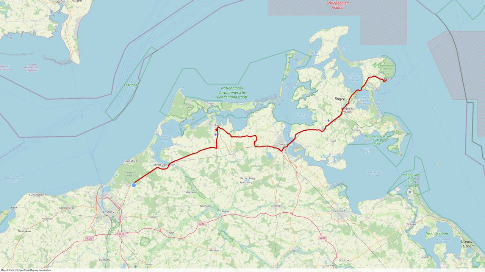

# GPXVideo

This script takes a GPS track from a GPX file and creates a video from it showing the track on a map. The map is taken from the OpenStreetmap project.

## Usage

    $ python .\gpxvideo.py --help                           
    usage: gpxvideo.py [-h] --gpxfile GPXFILE [--width WIDTH] [--height HEIGHT] [--fps FPS] [--trackwidth TRACKWIDTH]
                    [--trackcolor {black,blue,brown,green,orange,purple,red,white,yellow}] [--maptype {none,osm}]

    Create Video from GPX file

    options:
    -h, --help            show this help message and exit
    --gpxfile GPXFILE     GPX file
    --width WIDTH         Width of the output file
    --height HEIGHT       Height of the output file
    --fps FPS             Frames per second
    --trackwidth TRACKWIDTH
                            Width of the track
    --trackcolor {black,blue,brown,green,orange,purple,red,white,yellow}
                            Color of the track
    --maptype {none,osm}  Map style to use for the background   

## Setup

Install prerequesites if needed, see the [Cairo Getting Started Guide](https://pycairo.readthedocs.io/en/latest/getting_started.html) for more information.

    # clone the repository
    git clone git@github.com:schneidr/GPXVideo.git
    # create a virtual environment
    python3 -m virtualenv GPXVideo
    cd GPXVideo
    # activate the virtual environment
    source bin/activate
    # install required python modules
    pip install -r requirements.txt
